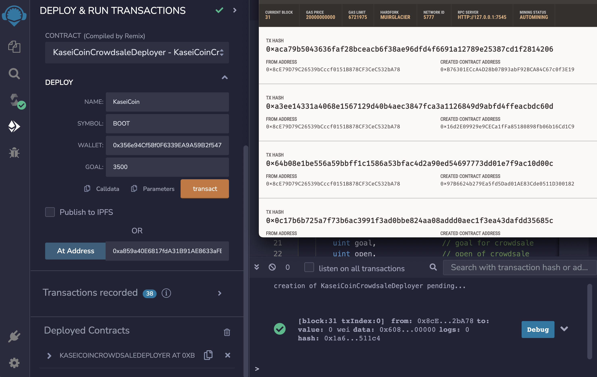

# **Columbia University Engineering, New York FinTech Bootcamp** 
# **August 2022 Cohort**
# **Module 21, Challenge - building a blockchain based monetary system for use in Mars planetary colony.**


Scenario - Fintech professional, chosen to lead a project to develop a new monetary system of exchange for interplanetary colonization.

Objective - develop a blockchain technology based monetary system. 

Product - Solidity smart contract that accepts two user addresses. 
> cryptocurrency named KaseiCoin. (“Kasei” means “Mars” in Japanese.)
> fungible token.
> ERC-20 compliant. 
> blockchain crowdsale / initial coin offerring (ICO).

 


### Evaluation Evidence


Initial compile & deploy

Deploy using Ganache address

Deploy using Metamask address

Deployer successfully compiled and deployed using Ganache and Metamask


Initialize crowdsale


Crowdsale


Added features/parameters

___

## **Technologies**
___


### **Dependencies**

This challenge leverages Solidity version 0.5.5 with the following IDE (Integrated Development Environment):

* [REMIX_IDE](https://remix-project.org/) - a no-setup tool with a GUI for developing smart contracts.
* [Ganache](https://trufflesuite.com/ganache/) - a private Ethereum blockchain environment that allows to you emulate the Ethereum blockchain so that you can interact with smart contracts in your own private blockchain.
* [MetaMask](https://metamask.io/) - a software cryptocurrency wallet used to interact with the Ethereum blockchain; enables access to Ethereum wallet through a browser extension or mobile app, which can then be used to interact with decentralized applications.

___

### **Hardware used for development**

MacBook Pro (16-inch, 2021)

    Chip Appple M1 Max
    macOS Venture version 13.0.1

### **Development Software**

Homebrew 3.6.11

    Homebrew/homebrew-core (git revision 01c7234a8be; last commit 2022-11-15)
    Homebrew/homebrew-cask (git revision b177dd4992; last commit 2022-11-15)

Python Platform: macOS-13.0.1-arm64-arm-64bit

    Python version 3.9.15 packaged by conda-forge | (main, Nov 22 2022, 08:52:10)
    Scikit-Learn 1.1.3
    pandas 1.5.1
    Numpy 1.21.5

pip 22.3 from /opt/anaconda3/lib/python3.9/site-packages/pip (python 3.9)


git version 2.37.2

---
## *Installation of application (i.e. github clone)*

In the terminal, navigate to directory where you want to install this application from the repository and enter the following command

```python
git clone git@github.com:Billie-LS/coins_outerworld_interplanetary_currency_block_yo_chain.git
```

---
## **Usage**

Using your web browser, to [REMIX_IDE](https://remix-project.org/) and initialize Remix Online IDE.  Then load the application from the project folder where you've installed the application:

```python
initiate the Solidity Compiler
```

In the Remix IDE, navigate to the “Deploy & Run Transactions” pane, and then make sure that “JavaScript VM” is selected as the environment
```python
Deploy & Run Transactions 
```

In the Remix IDE, Click the Deploy button to deploy the smart contract
```python
Deploy 
```
___

## **Version control**

Version control can be reviewed at:

```python
https://github.com/Billie-LS/coins_outerworld_interplanetary_currency_block_yo_chain
```

[repository](https://github.com/Billie-LS/coins_outerworld_interplanetary_currency_block_yo_chain)


___

### **Author**

Loki 'billie' Skylizard
    [LinkedIn](https://www.linkedin.com/in/l-s-6a0316244)
    [@GitHub](https://github.com/Billie-LS)

### **BootCamp lead instructor**

Vinicio De Sola
    [LinkedIn](https://www.linkedin.com/in/vinicio-desola-jr86/)
    [@GitHub](https://github.com/penpen86)


### **BootCamp teaching assistant**

Santiago Pedemonte
    [LinkedIn](https://www.linkedin.com/in/s-pedemonte/)
    [@GitHub](https://github.com/Santiago-Pedemonte)

___

### **Additional references and or resources utilized**


___
## **License**

MIT License

Copyright (c) [2022] [Loki 'billie' Skylizard]

Permission is hereby granted, free of charge, to any person obtaining a copy
of this software and associated documentation files (the "Software"), to deal
in the Software without restriction, including without limitation the rights
to use, copy, modify, merge, publish, distribute, sublicense, and/or sell
copies of the Software, and to permit persons to whom the Software is
furnished to do so, subject to the following conditions:

The above copyright notice and this permission notice shall be included in all
copies or substantial portions of the Software.

THE SOFTWARE IS PROVIDED "AS IS", WITHOUT WARRANTY OF ANY KIND, EXPRESS OR
IMPLIED, INCLUDING BUT NOT LIMITED TO THE WARRANTIES OF MERCHANTABILITY,
FITNESS FOR A PARTICULAR PURPOSE AND NONINFRINGEMENT. IN NO EVENT SHALL THE
AUTHORS OR COPYRIGHT HOLDERS BE LIABLE FOR ANY CLAIM, DAMAGES OR OTHER
LIABILITY, WHETHER IN AN ACTION OF CONTRACT, TORT OR OTHERWISE, ARISING FROM,
OUT OF OR IN CONNECTION WITH THE SOFTWARE OR THE USE OR OTHER DEALINGS IN THE
SOFTWARE.


